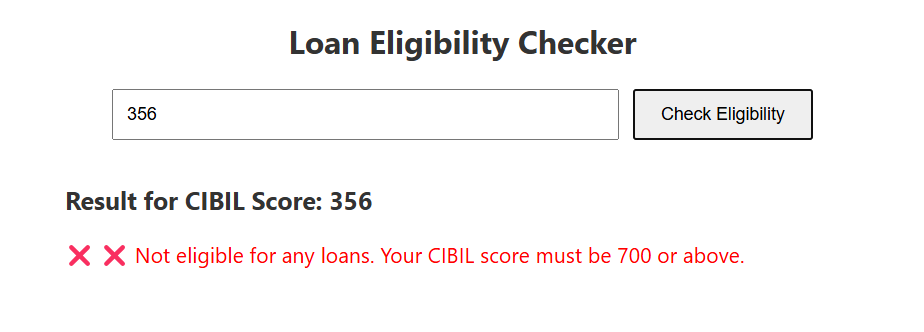

#  CIBIL Score Predictor & Loan Eligibility Checker

A full-stack web app that predicts your CIBIL score based on financial inputs and suggests eligible loan types with estimated amounts.

##  Features

-  Predict CIBIL scores and offer tips using a trained machine learning model
-  Check eligible loan types for given credit score with dynamic calculations
-  Beautiful and responsive UI
-  Backend with Python ML model
-  Frontend in React, Backend in Node.js + Express

##  Tech Stack

| Layer       | Technology                |
|-------------|---------------------------|
| Frontend    | React, HTML, CSS          |
| Backend     | Node.js, Express          |
| Machine Learning | Python, scikit-learn |
| Data        | CSV files (CIBIL & Loans) |


##  How to Run

### Clone the repository
```bash
git clone https://github.com/PranaviKandikonda/cibil-score-predictor.git
cd cibil-score-predictor
```

### Backend (Node + Python)
```bash
cd backend
npm install
```
#### Set up python(for ML model)
```bash
cd backend\model_files
# Create a virtual environment
python -m venv venv
# Activate virtual environment
#For windows
venv\Scripts\activate    
#For macOS/Linux
source venv/bin/activate
#Install pythn
```

### Frontend (React)
```bash
cd frontend
npm install
npm start
```

## Demo

### Home Page


### Credit Score Predictor
 
#### Output


The Credit Score Checker predicts a user's credit score based on various financial and personal details like income, credit history, loan types, and spending behavior. The user fills out a form on the frontend, and the data is sent to a Node.js backend, which communicates with a Python machine learning model trained on historical data. The model processes the input and returns a simulated CIBIL score, which is then displayed on the webpage.

### Loan Eligibility Checker



The Loan Eligibility Checker takes a user's CIBIL score as input and predicts the types of loans they are eligible for, along with the maximum amount for each. When a user submits their score, it is sent to a Node.js backend, which runs a Python script to calculate loan eligibility using a custom formula. The results—including loan types like home, car, education, and personal—are then sent back and displayed on the frontend.
